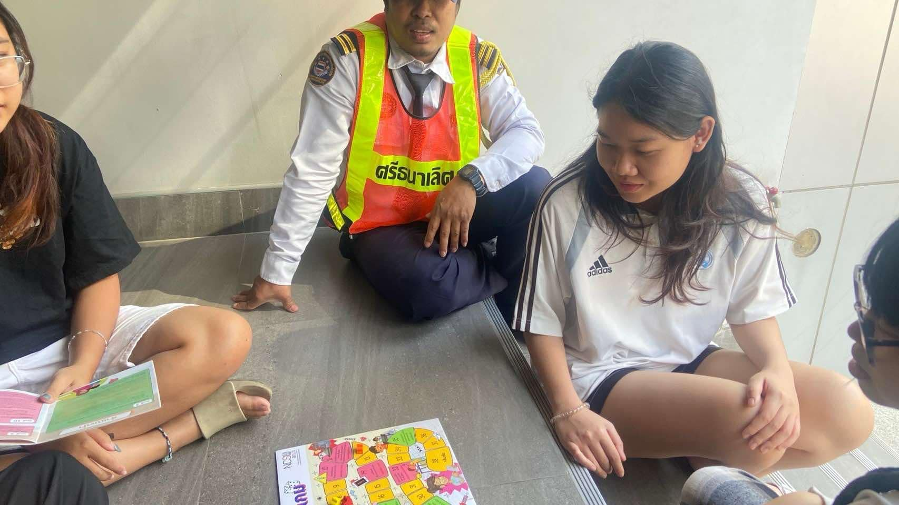
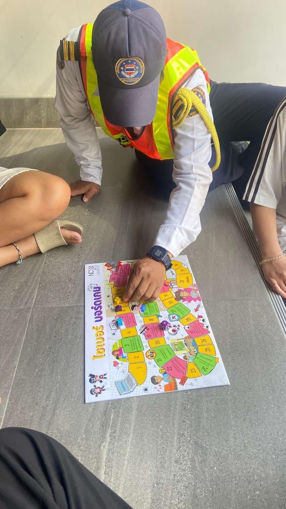
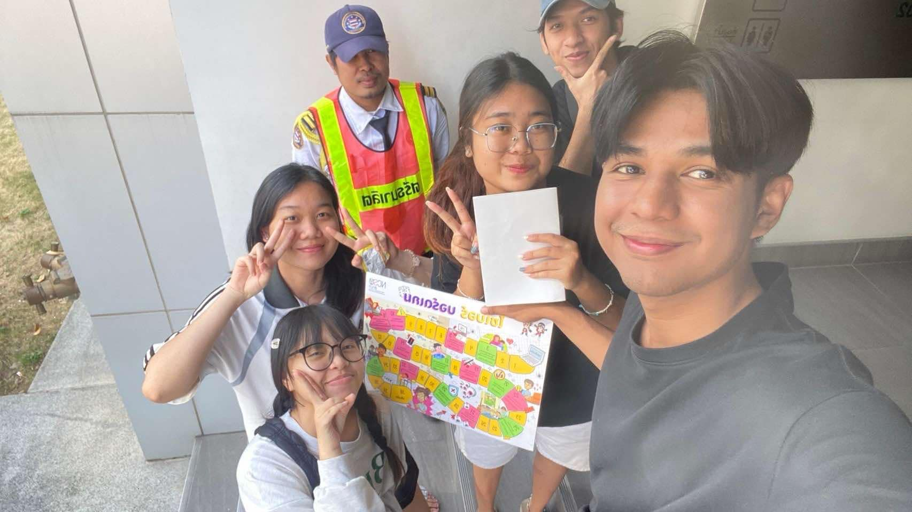
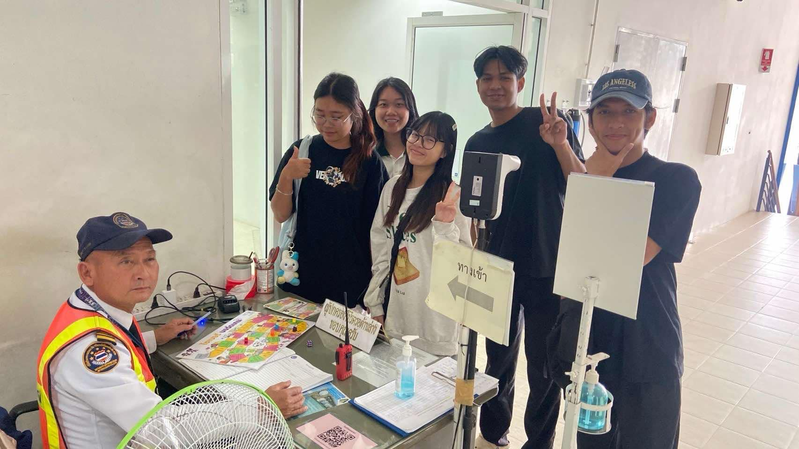

# 🛡️ Cyber Security Board Game: การผจญภัยแห่งความปลอดภัยไซเบอร์ 🌐

  

## เกมแห่งการป้องกัน และการเรียนรู้  
**รายละเอียดกิจกรรม:**  
- **วันที่:** 19 มกราคม 2568  
- **เวลา:** 15.00 น.  
- **สถานที่:** อาคาร 24 พาณิชย์ นาวี  

---

  

## เบื้องหลังกิจกรรม 🎮
กิจกรรมนี้ไม่ใช่แค่การเล่นเกม แต่เป็นการเดินทางแห่งการเรียนรู้ที่น่าตื่นเต้น!  
**กลุ่ม Habang** ซึ่งประกอบด้วยนิสิตสาขา *Computer Science* ได้ออกแบบประสบการณ์นี้เพื่อถ่ายทอดความรู้เรื่องความปลอดภัยไซเบอร์ให้กับเยาวชน  

---

  

## 🎲 กลไกและวิธีการเล่นบอร์ดเกม  
1. **การเลือกผู้เริ่มเกม 🎳**  
   ทอยลูกเต๋าระห่ำ! ผู้ได้แต้มสูงสุดจะได้เป็นผู้นำในเกม  

2. **การเดินและการต่อสู้ 🕹️**  
   เดินตามแต้มลูกเต๋า ระวังช่องพิเศษ!  

3. **เส้นชัยและรางวัล 🏆**  
   เป้าหมาย: เป็นเซียนไซเบอร์ประจำวัน!  

---

  

## 👥 Team Habang  
- Teerakorn Tangwattanakit  
- Panumas Chathaisong  
- Manitchaya Benjajuedsiri  
- Auksara Suwannawayak  
- Addeen Salaehsakul [Github](https://itzdeenzxx.github.io/boardgame)

---

  

> “เยาวชนต้องรู้เท่าทันโลกดิจิทัล การเรียนรู้ผ่านเกมจะช่วยให้เข้าใจและจดจำได้ง่าย”  

---

## 🌸 บทสรุป: ความรู้คือพลัง  
กิจกรรมนี้มอบมากกว่าความสนุก - มันคือการเตรียมพร้อมสำหรับโลกดิจิทัลที่ซับซ้อน  
เราเชื่อว่าทุกคนสามารถเป็นผู้พิทักษ์ไซเบอร์ได้!  
