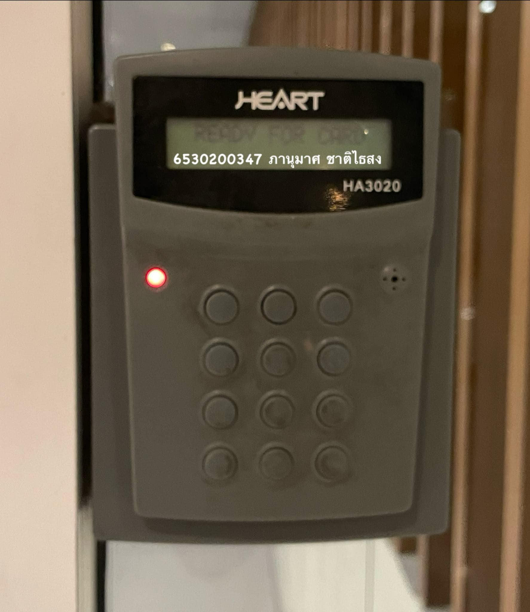

# 🔒 Security Control 🔑  
## **Digital Door Lock**  
(กลอนประตูดิจิทัล)  

**📍 สถานที่ :**  
หอพักโฮมสวีท เรสซิเด้นท์, ทุ่งสุขลา, ศรีราชา, ชลบุรี  

---

### ❀ **Types of Security Controls: Physical Controls**  
กลอนประตูดิจิทัลถือเป็นหนึ่งในมาตรการควบคุมทางกายภาพที่จับต้องได้ โดยมีบทบาทสำคัญในการปกป้องทรัพย์สินและเพิ่มความสะดวกสบายให้แก่ผู้ใช้งาน  
ด้วยเทคโนโลยีที่ทันสมัย เช่น  

- การตั้งรหัสผ่าน  
- ระบบสแกนลายนิ้วมือ  
- คีย์การ์ด  

ช่วยให้ผู้ใช้งานสามารถควบคุมการเข้าออกพื้นที่ได้อย่างมีประสิทธิภาพ ลดความเสี่ยงที่อาจเกิดจากการใช้กุญแจแบบดั้งเดิม ซึ่งอาจสูญหายหรือถูกทำสำเนาโดยไม่ได้รับอนุญาต  

---

### ❀ **Control Functions: Preventative**  
กลอนประตูดิจิทัลทำหน้าที่เป็นมาตรการควบคุมเชิงป้องกัน โดยมีบทบาทในการป้องกันการเข้าถึงจากบุคคลที่ไม่ได้รับอนุญาต  
ผู้ใช้งานสามารถตั้งค่าความปลอดภัยได้ตามความต้องการ เช่น  

- การกำหนดรหัสผ่านที่เปลี่ยนแปลงได้  
- ระบบล็อกอิเล็กทรอนิกส์ที่ปลอดภัย  

สิ่งนี้ช่วยลดโอกาสการละเมิดความปลอดภัยและสร้างความมั่นใจว่าพื้นที่สำคัญจะได้รับการปกป้องจากการบุกรุก  

---

### 🛡️ **สรุป**  
กลอนประตูดิจิทัลเป็นมาตรการควบคุมทางกายภาพและเชิงป้องกันที่มีประสิทธิภาพสูง  
- มอบความปลอดภัยที่เชื่อถือได้  
- ใช้งานง่าย  
- ตอบโจทย์การรักษาความปลอดภัยได้อย่างครอบคลุม  

